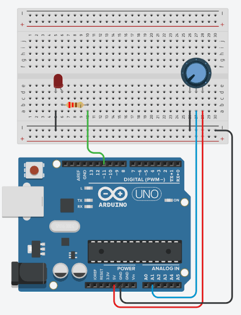

# Arduino Analog LED Dimmer Using a Potentiometer

## Project Overview

This Arduino project demonstrates how an analog input device can be used to control the brightness of an LED in real time. By rotating a potentiometer, the Arduino continuously measures the changing voltage and adjusts the LED intensity through Pulse Width Modulation (PWM). The project provides a practical introduction to analog sensing and variable output control.

---

## Project Goals

This project was developed to achieve the following learning objectives:

* Understand how Arduino acquires analog signals from external components.
* Learn how Pulse Width Modulation (PWM) controls LED brightness.
* Convert analog sensor readings into PWM-compatible output values.
* Develop familiarity with continuous real-time interaction between hardware components.
* Strengthen basic circuit-building and Arduino programming skills.

---

## Hardware Components

The following components were used to build this project:

* Arduino Uno
* Potentiometer
* LED
* 220Ω Resistor
* Breadboard
* Jumper Wires
* 9V Battery
* 9V Battery Clip with DC Barrel Jack
* Active Buzzer

---

## System Operation

The potentiometer acts as a variable voltage divider whose output changes as the knob is rotated.

The Arduino continuously samples this voltage through one of its analog input pins using the `analogRead()` function. Since the returned value ranges from 0 to 1023, it must be converted into the PWM range of 0 to 255 before being used to control the LED.

The converted value is then transmitted to a PWM-enabled digital pin using `analogWrite()`. As the potentiometer position changes, the LED brightness increases or decreases instantly, creating smooth and responsive control.

This process repeats continuously while the Arduino is powered.

---

## Circuit Configuration

The circuit consists of a potentiometer connected to an analog input, an LED connected to a PWM output pin through a current-limiting resistor, and the necessary power connections.

The circuit diagram illustrating these connections is included in this repository.

---

## Program Source

The Arduino sketch for this project can be found inside the **code/** directory of this repository.

---

## Demonstration

A demonstration video has been included to showcase the completed project in operation.

The video illustrates:

* Real-time adjustment of LED brightness
* Potentiometer response
* Stable PWM-based intensity control

If GitHub does not preview the video automatically, it can be downloaded directly from the repository.

---

## Skills Gained

Completing this project provided practical experience in:

* Reading analog sensor inputs
* Working with PWM outputs
* Scaling sensor values for hardware control
* Building simple electronic circuits
* Developing interactive embedded systems
* Understanding continuous program execution using the Arduino loop

---

## Development Challenges

Several practical challenges were encountered during development, including:

* Ensuring the potentiometer was connected correctly for stable analog readings.
* Understanding the relationship between analog input values and PWM output levels.
* Achieving smooth LED brightness changes without noticeable flickering.
* Verifying proper wiring and component connections during testing.

---

## Future Enhancements

Potential improvements for future versions include:

* Implementing gradual fade transitions for smoother brightness changes.
* Adding an LCD or OLED display to show live analog readings.
* Including multiple LEDs with independent brightness control.
* Expanding the project to support serial monitoring for debugging and visualization.
* Incorporating additional analog sensors for more advanced control applications.

---

## Project Completion Status

**Status:** Completed

This project successfully demonstrates the use of analog input processing and PWM output control on the Arduino platform, providing a strong foundation for more advanced embedded systems and hardware interface projects.
